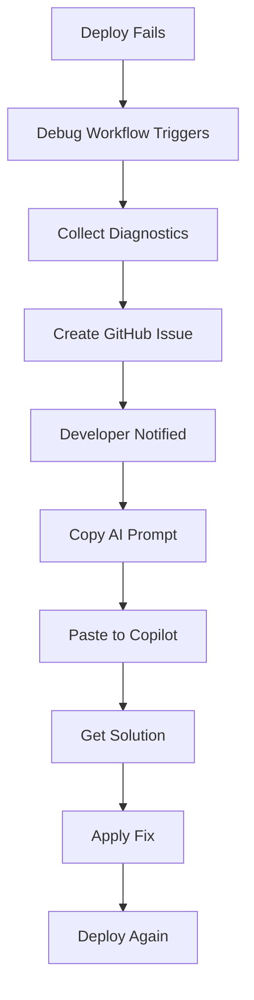

# Workflow Debugging Agent - Usage Examples

This document provides practical examples for using the AFU-9 Automated Workflow Debugging Agent.

## Table of Contents

1. [Basic Usage](#basic-usage)
2. [Advanced Scenarios](#advanced-scenarios)
3. [Integration with CI/CD](#integration-with-cicd)
4. [Troubleshooting](#troubleshooting)

## Basic Usage

### Example 1: Automatic Debugging After Deployment Failure

**Scenario**: A deployment to production fails due to a database migration error.

**What Happens Automatically**:

1. `deploy-ecs.yml` workflow fails at the "Run database migrations (gate)" step
2. `debug-deploy-failures.yml` workflow automatically triggers
3. System collects:
   - Workflow run metadata
   - Failed job and step details
   - ECS service diagnostics
   - Recent stopped tasks
4. GitHub issue is created: **🔴 Deploy Failure: main (Run #123)**

**Developer Action**:

```bash
# 1. Check GitHub issues
# Navigate to: https://github.com/adaefler-art/codefactory-control/issues
# Filter by label: automated-debugging

# 2. Open the issue and review the analysis
# The issue contains:
# - Failed step: "Run database migrations (gate)"
# - Detected pattern: "Database Migration"
# - Recommendation: "Check database connectivity, migration scripts, and RDS security groups"

# 3. Expand the "AI Analysis Prompt" section and copy it

# 4. Paste into VS Code Copilot or ChatGPT for deeper analysis
```

**Expected Result**: Issue is identified and fixed within minutes instead of hours.

---

### Example 2: Manual Analysis of Latest Failure

**Scenario**: You want to quickly analyze the most recent deployment failure without waiting for automation.

```bash
# Set your GitHub token
export GITHUB_TOKEN="<YOUR_GITHUB_TOKEN>"

# Analyze the latest failed deployment
node scripts/analyze-workflow-failure.js --latest-failure --verbose

DOCS_VERSION=$(cat docs/CURRENT_VERSION)

# Review the generated report
cat "docs/$DOCS_VERSION/generated/workflow-failure-report.md"

# Copy AI prompt for detailed analysis
cat ai-debug-prompt.txt | pbcopy  # macOS
# or
cat ai-debug-prompt.txt | xclip -selection clipboard  # Linux
# or
cat ai-debug-prompt.txt  # Just display it

# Paste into your AI assistant
```

**Output Example**:
```
Found latest failed run: 9876543210

# AFU-9 Deployment Failure Analysis

**Workflow Run**: [#42](https://github.com/...)
**Branch**: `main`
**SHA**: `abc1234567890`
**Triggered by**: @developer
**Status**: failure

## Failed Jobs

### Build and Deploy to ECS
- **Status**: failure
- [View Job Logs](https://github.com/...)

**Failed Steps**:
- 5. `Run database migrations (gate)`

## Detected Error Patterns
- **Database Migration** (detected in: Run database migrations (gate))

## Recommendations
1. Check database connectivity, migration scripts, and RDS security groups
2. Review the workflow run logs
3. Consult deployment documentation
```

---

### Example 3: Analyzing a Specific Workflow Run

**Scenario**: You need to analyze a deployment that failed yesterday (run ID: 1234567890).

```bash
# Analyze specific run
export GITHUB_TOKEN="<YOUR_GITHUB_TOKEN>"
node scripts/analyze-workflow-failure.js --run-id 1234567890

# Create a GitHub issue for the team
node scripts/analyze-workflow-failure.js --run-id 1234567890 --create-issue

# Check the created issue
# Navigate to GitHub Issues and find the new issue with label "automated-debugging"
```

---

## Advanced Scenarios

### Example 4: Batch Analysis of Multiple Failures

**Scenario**: You want to identify patterns across multiple recent failures.

```bash
#!/bin/bash
# analyze-recent-failures.sh

export GITHUB_TOKEN="<YOUR_GITHUB_TOKEN>"

# Get last 5 failed workflow runs
gh api repos/adaefler-art/codefactory-control/actions/workflows/deploy-ecs.yml/runs \
  --jq '.workflow_runs[:5] | .[] | select(.conclusion == "failure") | .id' | \
while read run_id; do
  echo "Analyzing run $run_id..."
  node scripts/analyze-workflow-failure.js --run-id "$run_id" 2>/dev/null | \
    grep -A 10 "Detected Error Patterns"
  echo "---"
done
```

**Sample Output**:
```
Analyzing run 1234567890...
## Detected Error Patterns
- **Database Migration** (detected in: Run database migrations)
---
Analyzing run 1234567891...
## Detected Error Patterns
- **ECS Deployment** (detected in: Update ECS service)
---
Analyzing run 1234567892...
## Detected Error Patterns
- **AWS Authentication** (detected in: Configure AWS credentials)
---
```

**Insight**: If you see the same pattern repeatedly, it indicates a systemic issue that needs addressing.

---

### Example 5: Integration with Slack Notifications

**Scenario**: Automatically post debugging analysis to Slack when deployment fails.

Create `.github/workflows/notify-slack-on-deploy-failure.yml`:

```yaml
name: Notify Slack on Deploy Failure

on:
  workflow_run:
    workflows: ["Debug Deploy Failures"]
    types:
      - completed

jobs:
  notify:
    runs-on: ubuntu-latest
    if: github.event.workflow_run.conclusion == 'success'
    steps:
      - name: Download debug analysis
        uses: actions/github-script@v7
        with:
          script: |
            // Get the workflow run that triggered the debug workflow
            // Extract debugging summary
            // Post to Slack webhook
            
      - name: Post to Slack
        uses: slackapi/slack-github-action@v1
        with:
          payload: |
            {
              "text": "🔴 Deploy Failure Detected",
              "blocks": [
                {
                  "type": "section",
                  "text": {
                    "type": "mrkdwn",
                    "text": "Deployment failed - automated analysis available\n<${{ github.event.workflow_run.html_url }}|View Details>"
                  }
                }
              ]
            }
        env:
          SLACK_WEBHOOK_URL: ${{ secrets.SLACK_WEBHOOK_URL }}
```

---

### Example 6: Pre-Deployment Dry Run

**Scenario**: Test the debugging agent before an actual failure occurs.

```bash
# Create a mock failure scenario
cat > mock-failure.json << 'EOF'
{
  "run": {
    "id": 9999999999,
    "run_number": 999,
    "conclusion": "failure",
    "head_branch": "test-branch",
    "head_sha": "test123",
    "triggering_actor": { "login": "test-user" }
  },
  "jobs": {
    "jobs": [{
      "name": "Test Job",
      "conclusion": "failure",
      "steps": [
        { "name": "Test Database Migration", "conclusion": "failure", "number": 1 }
      ]
    }]
  }
}
EOF

# Run the test analyzer
node scripts/test-workflow-analyzer.js

# Verify all tests pass
# Expected: "🎉 All tests passed!"
```

---

## Integration with CI/CD

### Example 7: Auto-Create PR with Fixes (Future Enhancement)

**Scenario**: Automatically create a PR with suggested fixes for common errors.

```yaml
# .github/workflows/auto-fix-deploy-failures.yml
name: Auto-Fix Deploy Failures

on:
  workflow_run:
    workflows: ["Debug Deploy Failures"]
    types:
      - completed

jobs:
  auto-fix:
    runs-on: ubuntu-latest
    if: github.event.workflow_run.conclusion == 'success'
    steps:
      - name: Checkout code
        uses: actions/checkout@v4
        
      - name: Analyze failure
        id: analyze
        run: |
          node scripts/analyze-workflow-failure.js --latest-failure
          
      - name: Apply common fixes
        run: |
          # Check error pattern and apply appropriate fix
          DOCS_VERSION=$(cat docs/CURRENT_VERSION)
          ERROR_PATTERN=$(jq -r '.error_patterns[0].category' "docs/$DOCS_VERSION/generated/workflow-failure-analysis.json")
          
          case "$ERROR_PATTERN" in
            "Database Migration")
              # Fix migration scripts
              echo "Analyzing migration scripts..."
              ;;
            "ECS Deployment")
              # Fix task definition
              echo "Checking task definition..."
              ;;
            "AWS Authentication")
              # Update IAM policies
              echo "Validating IAM roles..."
              ;;
          esac
          
      - name: Create PR if fixes available
        if: success()
        uses: peter-evans/create-pull-request@v5
        with:
          title: "🤖 Auto-fix: ${{ steps.analyze.outputs.error_category }}"
          body: "Automated fix for deployment failure"
          branch: "auto-fix/${{ github.run_id }}"
```

---

## Troubleshooting

### Example 8: Debug the Debugger

**Scenario**: The debugging workflow itself is failing.

```bash
# Check workflow permissions
gh api repos/adaefler-art/codefactory-control/actions/permissions

# Verify workflow exists and is enabled
gh workflow list | grep -i debug

# Check recent runs
gh run list --workflow=debug-deploy-failures.yml --limit 5

# View specific run logs
gh run view <run-id> --log

# Test the analysis script locally
export GITHUB_TOKEN="<YOUR_GITHUB_TOKEN>"
node scripts/analyze-workflow-failure.js --latest-failure --verbose 2>&1 | tee debug-output.log
```

---

### Example 9: Validate Permissions

**Scenario**: Ensure the workflow has necessary permissions.

```bash
# Check if workflow can access other workflow runs
gh api repos/adaefler-art/codefactory-control/actions/runs \
  --jq '.workflow_runs[0] | {id, name, conclusion}'

# Verify issue creation permission
gh api repos/adaefler-art/codefactory-control/issues \
  -X POST \
  -f title="Test Issue" \
  -f body="Testing permissions" \
  -f labels[]="test"

# Clean up test issue
gh issue close <issue-number>
```

---

### Example 10: Monitor Debugging Agent Health

**Scenario**: Create a dashboard to monitor the debugging agent's effectiveness.

```bash
#!/bin/bash
# monitor-debug-agent.sh

echo "=== Debugging Agent Health Report ==="
echo ""

# Count automated issues created
AUTOMATED_ISSUES=$(gh issue list --label "automated-debugging" --json number --jq '. | length')
echo "Automated Issues Created: $AUTOMATED_ISSUES"

# Count successful debug workflow runs
DEBUG_RUNS=$(gh run list --workflow=debug-deploy-failures.yml --json conclusion --jq '. | length')
echo "Debug Workflow Runs: $DEBUG_RUNS"

# Average time to resolution for automated issues
echo ""
echo "Recent Automated Issues:"
gh issue list --label "automated-debugging" --limit 5 --json number,title,createdAt,closedAt,state

# Pattern distribution
echo ""
echo "Most Common Error Patterns (last 10 issues):"
gh issue list --label "automated-debugging" --limit 10 --json body --jq '.[].body' | \
  grep -o "Database Migration\|ECS Deployment\|AWS Authentication" | \
  sort | uniq -c | sort -rn
```

---

## Real-World Workflow

### Complete Debugging Workflow

**When a deployment fails:**



**Time Saved**: 
- Before: 30-60 minutes of manual log analysis
- After: 2-5 minutes from notification to fix

---

## Summary

The Automated Workflow Debugging Agent provides:
- ✅ **Zero-touch debugging** for common failures
- ✅ **Pattern recognition** across multiple deployments
- ✅ **AI-ready prompts** for complex issues
- ✅ **Automatic issue creation** for team collaboration
- ✅ **Time savings** of 25-55 minutes per deployment failure

For more information, see:
- [Full Documentation](AUTOMATED_DEBUGGING_AGENT.md)
- [Quick Start Guide](DEBUGGING_QUICK_START.md)
- [Deploy System Prompt](deploy/AFU9_DEPLOY_SYSTEM_PROMPT.md)
