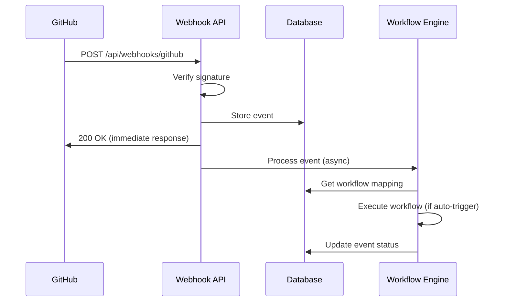

# GitHub Webhook Integration

AFU-9 includes a GitHub webhook handler that receives and processes webhook events from GitHub repositories.

## Features

- **Event Reception**: Receives GitHub webhook events (issues, pull requests, check runs)
- **Signature Validation**: Validates webhook signatures using HMAC-SHA256
- **Event Persistence**: Stores all webhook events in the database for audit and debugging
- **Workflow Mapping**: Maps webhook events to AFU-9 workflows
- **Auto-Triggering**: Optionally triggers workflows automatically based on event type
- **Monitoring UI**: Web interface to view and debug webhook events

## Setup

### 1. Configure Webhook Secret

Add the webhook secret to your environment configuration:

```bash
# In control-center/.env.local
GITHUB_WEBHOOK_SECRET=your_webhook_secret_here
```

Update the webhook configuration in the database:

```sql
UPDATE webhook_configs
SET secret_key = 'your_webhook_secret_here'
WHERE name = 'github';
```

### 2. Run Database Migration

Apply the webhook events schema:

```bash
psql -h your-db-host -U your-db-user -d your-db-name -f database/migrations/003_webhook_events.sql
```

### 3. Configure GitHub Repository Webhook

1. Go to your GitHub repository settings
2. Navigate to **Settings > Webhooks > Add webhook**
3. Configure the webhook:
   - **Payload URL**: `https://your-afu9-domain.com/api/webhooks/github`
   - **Content type**: `application/json`
   - **Secret**: Enter the same secret you configured above
   - **Events**: Select individual events:
     - Issues
     - Pull requests
     - Check runs
     - Check suites
   - **Active**: ✓ Enable webhook

4. Click **Add webhook**

## Webhook Event Flow



## Event Processing

### Supported Event Types

The webhook handler supports the following GitHub events:

- **issues**: Issue events (opened, closed, labeled, etc.)
- **pull_request**: Pull request events (opened, closed, merged, etc.)
- **check_run**: Check run events (completed, requested, etc.)
- **check_suite**: Check suite events

### Workflow Mappings

Configure workflow mappings in the `webhook_configs` table:

```json
{
  "issues.opened": {
    "workflow": "issue_to_pr",
    "auto_trigger": false
  },
  "pull_request.opened": {
    "workflow": null,
    "auto_trigger": false
  },
  "check_run.completed": {
    "workflow": null,
    "auto_trigger": false
  }
}
```

- `workflow`: Name of the AFU-9 workflow to trigger
- `auto_trigger`: Whether to automatically execute the workflow (default: false)

### Event Context

Webhook events are converted to workflow context:

```typescript
{
  variables: {},
  input: {
    event_type: "issues",
    event_action: "opened",
    issue: {
      number: 123,
      title: "Bug in feature X",
      body: "Description...",
      state: "open",
      labels: ["bug", "high-priority"]
    },
    sender: {
      login: "username",
      ...
    }
  },
  repo: {
    owner: "adaefler-art",
    name: "codefactory-control",
    default_branch: "main"
  }
}
```

## API Endpoints

### POST /api/webhooks/github

Receives GitHub webhook events.

**Headers:**
- `X-GitHub-Event`: Event type (e.g., "issues")
- `X-Hub-Signature-256`: HMAC-SHA256 signature
- `X-GitHub-Delivery`: Unique delivery ID

**Response:**
```json
{
  "success": true,
  "event_id": "abc123",
  "event_type": "issues",
  "event_action": "opened",
  "message": "Webhook received and queued for processing"
}
```

### GET /api/webhooks/events

List webhook events.

**Query Parameters:**
- `limit`: Number of events to return (default: 50)
- `offset`: Pagination offset (default: 0)
- `stats`: Return statistics only (boolean)

**Response:**
```json
{
  "events": [
    {
      "id": "uuid",
      "event_id": "abc123",
      "event_type": "issues",
      "event_action": "opened",
      "received_at": "2024-01-15T10:30:00Z",
      "processed": true,
      "workflow_execution_id": "uuid"
    }
  ],
  "pagination": {
    "limit": 50,
    "offset": 0,
    "total": 123,
    "hasMore": true
  }
}
```

### GET /api/webhooks/events/[id]

Get details of a specific webhook event.

**Response:**
```json
{
  "id": "uuid",
  "event_id": "abc123",
  "event_type": "issues",
  "event_action": "opened",
  "payload": { /* full GitHub payload */ },
  "received_at": "2024-01-15T10:30:00Z",
  "processed": true,
  "processed_at": "2024-01-15T10:30:02Z",
  "workflow_execution_id": "uuid"
}
```

## Monitoring UI

Access the webhook monitoring interface at `/webhooks` in the Control Center.

### Features

- **Statistics Dashboard**: View total events, processed count, and failures
- **Event List**: Browse all received webhook events with status
- **Event Details**: View full webhook payload and processing information
- **Real-time Updates**: Auto-refresh every 10 seconds
- **Execution Links**: Jump to workflow execution details

## Security

### Signature Verification

All webhook requests are verified using HMAC-SHA256:

1. GitHub signs the payload with the webhook secret
2. AFU-9 receives the signature in the `X-Hub-Signature-256` header
3. AFU-9 calculates the expected signature and compares using timing-safe comparison
4. Requests with invalid signatures are rejected with 401 Unauthorized

### Best Practices

- **Use a strong webhook secret**: Generate a cryptographically random secret
- **Rotate secrets regularly**: Update both GitHub and AFU-9 configuration
- **Monitor failed events**: Check the UI for suspicious activity
- **Use HTTPS**: Always use HTTPS for webhook endpoints in production

## Troubleshooting

### Webhook Not Receiving Events

1. Check GitHub webhook configuration
2. Verify the webhook URL is correct and accessible
3. Check GitHub webhook delivery logs for errors
4. Verify the webhook is enabled in GitHub

### Signature Verification Failures

1. Verify the secret matches in both GitHub and AFU-9
2. Check that the secret is correctly configured in the database
3. Ensure the raw request body is used for verification

### Events Not Processing

1. Check the webhook monitoring UI for errors
2. Verify the workflow mapping configuration
3. Check database logs for errors
4. Ensure the workflow exists and is enabled

### Database Connection Issues

1. Verify database credentials in environment variables
2. Check network connectivity to database
3. Ensure database migration has been applied

## Example Use Cases

### Auto-Create PR from Issue

Map `issues.opened` to the `issue_to_pr` workflow with `auto_trigger: true`:

```sql
UPDATE webhook_configs
SET workflow_mappings = jsonb_set(
  workflow_mappings,
  '{issues.opened}',
  '{"workflow": "issue_to_pr", "auto_trigger": true}'
)
WHERE name = 'github';
```

### Respond to Failed CI Checks

Map `check_run.completed` with conclusion `failure` to a debugging workflow:

```sql
UPDATE webhook_configs
SET workflow_mappings = jsonb_set(
  workflow_mappings,
  '{check_run.completed}',
  '{"workflow": "debug_failed_check", "auto_trigger": true}'
)
WHERE name = 'github';
```

## Development

### Local Testing

Use tools like [ngrok](https://ngrok.com/) or [smee.io](https://smee.io/) to forward webhooks to your local development environment:

```bash
# Using ngrok
ngrok http 3000

# Update GitHub webhook URL to:
# https://your-ngrok-url.ngrok.io/api/webhooks/github
```

### Testing with Sample Payloads

Test webhook processing with sample payloads:

```bash
curl -X POST http://localhost:3000/api/webhooks/github \
  -H "Content-Type: application/json" \
  -H "X-GitHub-Event: issues" \
  -H "X-Hub-Signature-256: sha256=..." \
  -H "X-GitHub-Delivery: 12345" \
  -d @sample-issue-payload.json
```

## References

- [GitHub Webhooks Documentation](https://docs.github.com/en/webhooks)
- [Securing Webhooks](https://docs.github.com/en/webhooks/using-webhooks/validating-webhook-deliveries)
- [Webhook Event Payloads](https://docs.github.com/en/webhooks/webhook-events-and-payloads)
