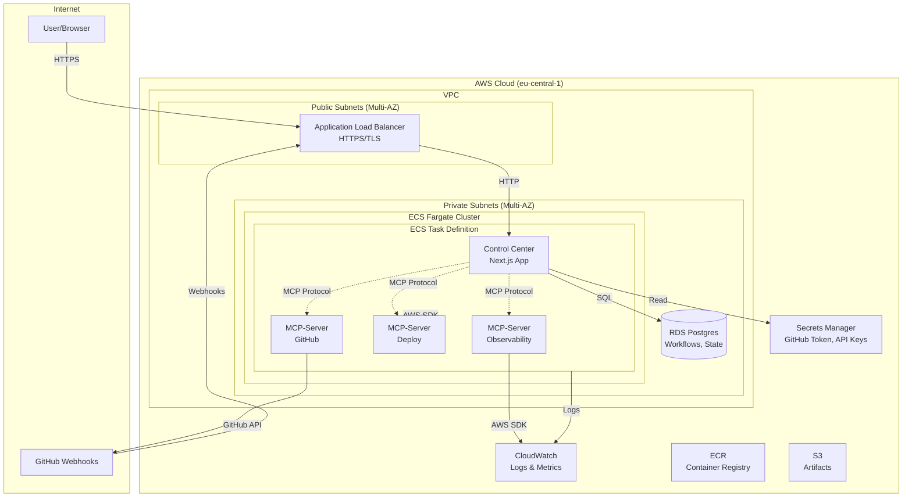
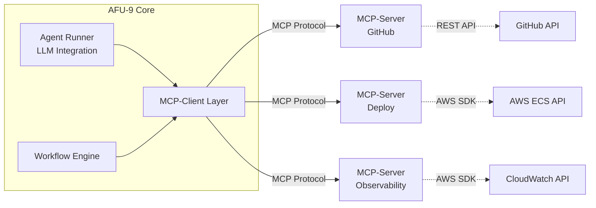

# AFU-9 v0.2 Architecture Overview

## Overview

AFU-9 (Autonomous Fabrication Unit – Ninefold Architecture) v0.2 is deployed on AWS using a modern, scalable architecture based on the Model Context Protocol (MCP) pattern.

> **📚 Comprehensive Guide**: For a complete architecture overview including AWS components, development workflow integration, and German documentation, see [AFU-9 v0.2 Architektur-Übersicht](./afu9-v0.2-overview.md)

## Architecture Principles

1. **MCP-First Design**: AFU-9 acts as an MCP-Client, consuming specialized MCP-Servers for different domains
2. **Containerized Deployment**: All components run as Docker containers on ECS Fargate
3. **Security by Design**: Secrets in AWS Secrets Manager, IAM roles with least privilege
4. **Observability**: Structured logging, metrics, and alerting via CloudWatch
5. **Scalability**: Stateless containers, managed database, load-balanced traffic

## High-Level Architecture



## Components

### 1. AWS Networking

#### VPC Configuration
- **CIDR**: `10.0.0.0/16`
- **Availability Zones**: Minimum 2 AZs for high availability
- **Subnets**:
  - Public Subnets: `10.0.1.0/24`, `10.0.2.0/24` (for ALB)
  - Private Subnets: `10.0.11.0/24`, `10.0.12.0/24` (for ECS Tasks and RDS)

#### Security Groups
- **ALB Security Group**:
  - Inbound: 443/HTTPS from 0.0.0.0/0
  - Outbound: All to ECS Security Group
  
- **ECS Security Group**:
  - Inbound: 3000/HTTP from ALB Security Group
  - Outbound: All (for GitHub API, AWS APIs)
  
- **RDS Security Group**:
  - Inbound: 5432/PostgreSQL from ECS Security Group only
  - Outbound: None

### 2. Application Load Balancer (ALB)

- **Purpose**: HTTPS termination, routing, health checks
- **Configuration**:
  - Listener: Port 443 (HTTPS) with ACM certificate
  - Target Group: ECS Service on port 3000
  - Health Check: `/api/health` endpoint
  - Idle Timeout: 60 seconds

### 3. ECS Fargate

#### ECS Cluster
- **Name**: `afu9-cluster`
- **Type**: Fargate (serverless container platform)
- **Region**: eu-central-1

#### ECS Service
- **Service Name**: `afu9-control-center`
- **Task Count**: 1 (scalable to N)
- **Deployment**: Rolling update
- **Load Balancer**: Attached to ALB target group

#### ECS Task Definition

The task definition includes multiple containers in a single task:

| Container | Purpose | Port | Resources |
|-----------|---------|------|-----------|
| `control-center` | Next.js UI & API | 3000 | 512 CPU, 1024 MB |
| `mcp-github` | GitHub operations | 3001 | 256 CPU, 512 MB |
| `mcp-deploy` | AWS ECS deployments | 3002 | 256 CPU, 512 MB |
| `mcp-observability` | CloudWatch access | 3003 | 256 CPU, 512 MB |

**Total Task Resources**: 1280 CPU units (1.28 vCPU), 2560 MB RAM

### 4. RDS Postgres

- **Engine**: PostgreSQL 15.x
- **Instance Class**: db.t4g.micro (1 vCPU, 1 GB RAM) - suitable for v0.2
- **Storage**: 20 GB GP3
- **Multi-AZ**: No (for v0.2, can be enabled for production)
- **Backup**: 7-day retention
- **Encryption**: At rest and in transit
- **Access**: Private subnets only, accessible from ECS tasks

#### Database Schema

See [database schema documentation](./database-schema.md) for detailed table definitions.

### 5. ECR (Elastic Container Registry)

Container images are stored in ECR repositories:

- `afu9/control-center`: Next.js application
- `afu9/mcp-github`: GitHub MCP-Server
- `afu9/mcp-deploy`: AWS Deploy MCP-Server
- `afu9/mcp-observability`: Observability MCP-Server

### 6. Secrets Manager

All sensitive data is stored in AWS Secrets Manager:

```json
{
  "afu9/github": {
    "token": "<REDACTED_GITHUB_TOKEN>",
    "app_id": "...",
    "private_key": "..."
  },
  "afu9/database": {
    "host": "afu9-db.xxxx.eu-central-1.rds.amazonaws.com",
    "port": "5432",
    "database": "afu9",
    "username": "afu9_admin",
    "password": "..."
  },
  "afu9/llm": {
    "openai_api_key": "<REDACTED_LLM_KEY>",
    "anthropic_api_key": "<REDACTED_LLM_KEY>"
  }
}
```

### 7. CloudWatch

#### Logs
- Log Groups per container: `/ecs/afu9/control-center`, `/ecs/afu9/mcp-github`, etc.
- Retention: 7 days (configurable)
- Format: Structured JSON logs

#### Metrics
- Standard ECS metrics (CPU, Memory, Network)
- Custom application metrics via CloudWatch SDK
- ALB metrics (request count, latency, 5xx errors)

#### Alarms
- ALB 5xx rate > 5%
- ECS Task CPU > 80%
- ECS Task Memory > 80%
- RDS CPU > 80%
- RDS Storage < 20%

## MCP Architecture Pattern

### What is MCP?

The Model Context Protocol (MCP) is a pattern for building AI applications where:
- **MCP-Client**: The main application (AFU-9 Control Center) that orchestrates work
- **MCP-Server**: Specialized services that provide tools/capabilities to the client

### AFU-9 MCP Implementation



### MCP-Server Specifications

See individual MCP-Server documentation:
- [GitHub MCP-Server](./mcp-github.md)
- [Deploy MCP-Server](./mcp-deploy.md)
- [Observability MCP-Server](./mcp-observability.md)

## IAM Roles & Permissions

### ECS Task Role

Attached to ECS tasks for application-level permissions:

```json
{
  "Version": "2012-10-17",
  "Statement": [
    {
      "Effect": "Allow",
      "Action": [
        "secretsmanager:GetSecretValue"
      ],
      "Resource": "arn:aws:secretsmanager:eu-central-1:*:secret:afu9/*"
    },
    {
      "Effect": "Allow",
      "Action": [
        "logs:CreateLogStream",
        "logs:PutLogEvents",
        "logs:FilterLogEvents"
      ],
      "Resource": "arn:aws:logs:eu-central-1:*:log-group:/ecs/afu9/*"
    },
    {
      "Effect": "Allow",
      "Action": [
        "cloudwatch:GetMetricStatistics",
        "cloudwatch:DescribeAlarms"
      ],
      "Resource": "*"
    },
    {
      "Effect": "Allow",
      "Action": [
        "ecs:DescribeServices",
        "ecs:UpdateService",
        "ecs:DescribeTasks"
      ],
      "Resource": [
        "arn:aws:ecs:eu-central-1:*:service/afu9-cluster/*",
        "arn:aws:ecs:eu-central-1:*:task/afu9-cluster/*"
      ]
    }
  ]
}
```

### ECS Task Execution Role

Used by ECS to pull images and write logs:

```json
{
  "Version": "2012-10-17",
  "Statement": [
    {
      "Effect": "Allow",
      "Action": [
        "ecr:GetAuthorizationToken",
        "ecr:BatchCheckLayerAvailability",
        "ecr:GetDownloadUrlForLayer",
        "ecr:BatchGetImage"
      ],
      "Resource": "*"
    },
    {
      "Effect": "Allow",
      "Action": [
        "logs:CreateLogGroup",
        "logs:CreateLogStream",
        "logs:PutLogEvents"
      ],
      "Resource": "*"
    },
    {
      "Effect": "Allow",
      "Action": [
        "secretsmanager:GetSecretValue"
      ],
      "Resource": "arn:aws:secretsmanager:eu-central-1:*:secret:afu9/*"
    }
  ]
}
```

## Deployment Flow

See [deployment documentation](./deployment.md) for detailed deployment instructions.

## Development Workflow

See [development guide](./development.md) for local development setup.

## Security Considerations

1. **No Secrets in Code**: All secrets in AWS Secrets Manager
2. **Least Privilege IAM**: Minimal permissions per role
3. **Network Isolation**: Private subnets for application and database
4. **Encryption**: RDS encryption at rest, TLS in transit
5. **Security Groups**: Strict ingress/egress rules
6. **Container Security**: Regular image updates, vulnerability scanning

## Monitoring & Observability

### Key Metrics to Monitor

- **Application**:
  - Request latency (p50, p95, p99)
  - Error rate (4xx, 5xx)
  - Workflow execution time
  - MCP tool call latency

- **Infrastructure**:
  - ECS task health
  - RDS CPU and connections
  - ALB healthy target count
  - Memory and CPU utilization

### Logging Strategy

All logs use structured JSON format:

```json
{
  "timestamp": "2025-12-11T14:52:34.835Z",
  "level": "info",
  "component": "workflow-engine",
  "workflow_id": "wf-123",
  "execution_id": "exec-456",
  "message": "Workflow step completed",
  "duration_ms": 1234,
  "step": "create_pr"
}
```

### Alerting

Alerts are sent via SNS to:
- Email (for critical alerts)
- Slack/webhook (for warnings)

## Cost Estimation (v0.2)

Monthly AWS costs (approximate):

| Service | Configuration | Cost/Month |
|---------|--------------|------------|
| ECS Fargate | 1 task, 1.28 vCPU, 2.5 GB | ~$30 |
| RDS Postgres | db.t4g.micro, 20 GB | ~$15 |
| ALB | 1 load balancer | ~$20 |
| Data Transfer | ~10 GB/month | ~$1 |
| CloudWatch | Logs + Metrics | ~$5 |
| **Total** | | **~$71** |

*Note: Costs will increase with usage (more tasks, data transfer, log volume)*

## Future Enhancements (Post v0.2)

1. **Auto-scaling**: ECS service auto-scaling based on CPU/request metrics
2. **Multi-Region**: Deploy to multiple AWS regions for DR
3. **CDN**: CloudFront for static assets
4. **Caching**: ElastiCache for Redis
5. **Advanced Monitoring**: X-Ray for distributed tracing
6. **Cost Optimization**: Savings Plans, Reserved Instances for RDS

## Key Development Patterns

AFU-9 follows strict patterns for data handling and API development:

- **[API Boundary Normalization](./API_BOUNDARY_NORMALIZATION.md)**: Mandatory pattern for safely serializing database data at API boundaries to prevent output contract validation failures
- **[Database Schema](./database-schema.md)**: PostgreSQL schema definitions and constraints
- **[MCP Protocol](./mcp-protocol.md)**: Communication pattern between Control Center and MCP-Servers

## References

- [AWS ECS Best Practices](https://docs.aws.amazon.com/AmazonECS/latest/bestpracticesguide/)
- [Model Context Protocol Specification](https://spec.modelcontextprotocol.io/)
- [Next.js Deployment on AWS](https://nextjs.org/docs/deployment)
- [PostgreSQL on RDS](https://docs.aws.amazon.com/AmazonRDS/latest/UserGuide/CHAP_PostgreSQL.html)
