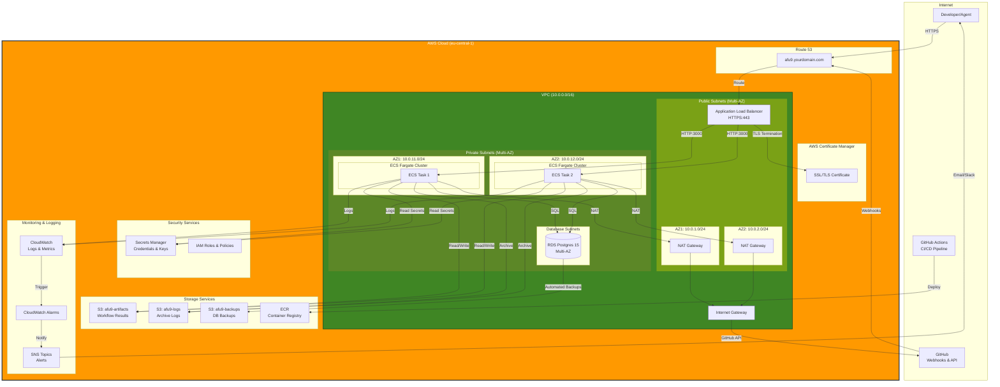
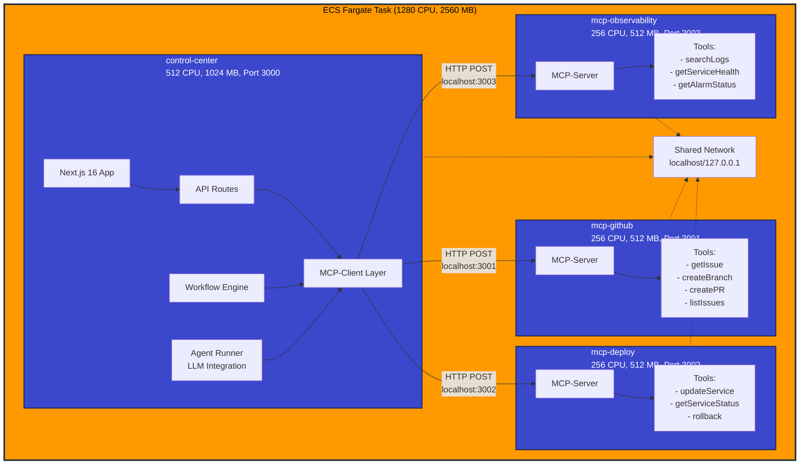
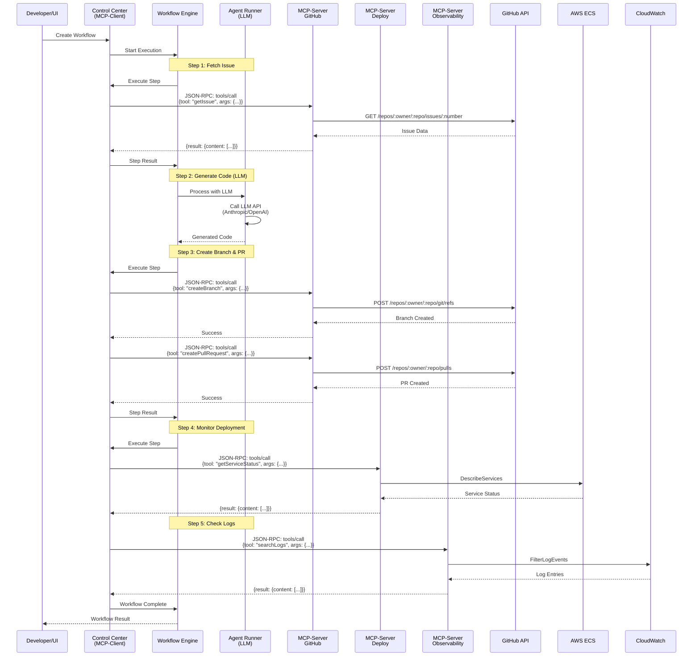
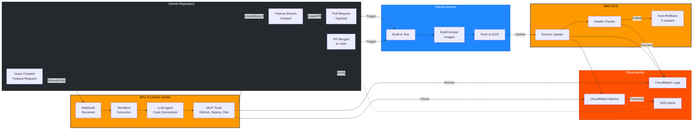
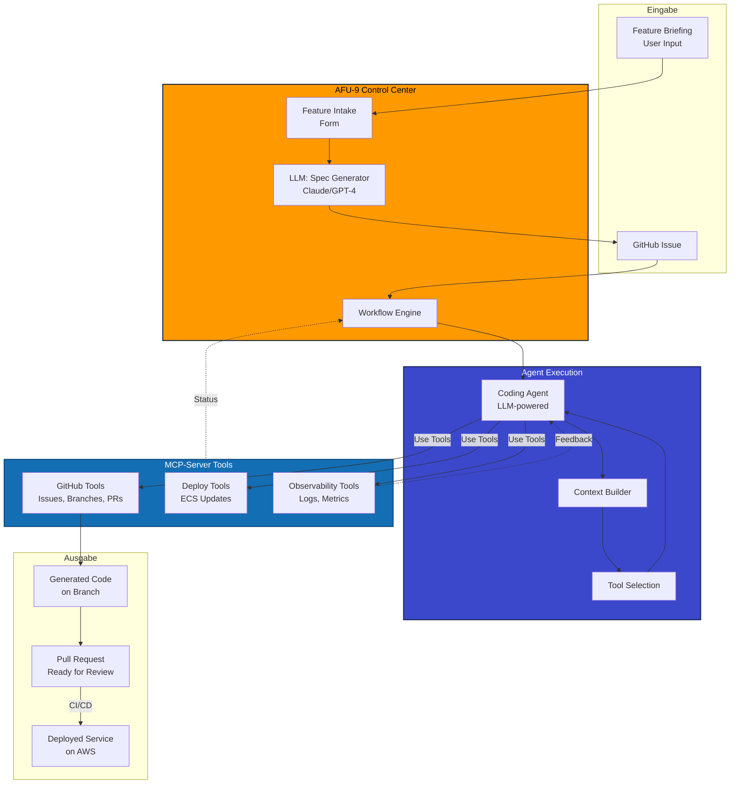

# AFU-9 v0.2 Architektur-Übersicht (AWS + MCP)

## Überblick

AFU-9 (Autonomous Fabrication Unit – Ninefold Architecture) v0.2 ist eine produktionsreife, autonome Code-Fabrication-Plattform, die auf AWS mit dem Model Context Protocol (MCP) Pattern implementiert ist.

Diese Architektur ermöglicht:
- **Autonome Workflows**: Von GitHub Issue bis zum Pull Request
- **LLM-Integration**: Anthropic Claude und OpenAI für Code-Generierung
- **Skalierbare Infrastruktur**: ECS Fargate mit horizontaler Skalierung
- **Modulare Services**: MCP-basierte Tool-Provider für verschiedene Domänen
- **CI/CD Integration**: Nahtlose Integration in den Entwicklungs-Workflow

## System-Architektur

### Komplette AWS-Infrastruktur



### ECS Task Architektur (Container-Aufteilung)



### MCP-Pattern: Client-Server Architektur



## Entwicklungs-Workflow Integration

### Kompletter Workflow: Issue → Code → Deployment



### Agent-basierter Workflow



## AWS-Komponenten im Detail

### 1. VPC und Netzwerk

**Konfiguration:**
- **VPC CIDR**: `10.0.0.0/16`
- **Availability Zones**: 2 (eu-central-1a, eu-central-1b)
- **Public Subnets**: `10.0.1.0/24`, `10.0.2.0/24`
  - Internet Gateway für ausgehenden Traffic
  - NAT Gateways für private Subnets
  - Application Load Balancer
- **Private Subnets**: `10.0.11.0/24`, `10.0.12.0/24`
  - ECS Fargate Tasks
  - RDS Postgres Instanzen
  - Kein direkter Internet-Zugang (nur via NAT)

**Security Groups:**
```
ALB Security Group:
  Inbound:  443/HTTPS from 0.0.0.0/0
  Outbound: 3000/HTTP to ECS Security Group

ECS Security Group:
  Inbound:  3000/HTTP from ALB Security Group
  Outbound: 443/HTTPS to Internet (via NAT)
           5432/PostgreSQL to RDS Security Group

RDS Security Group:
  Inbound:  5432/PostgreSQL from ECS Security Group only
  Outbound: None
```

### 2. Application Load Balancer (ALB)

**Features:**
- **HTTPS Termination**: SSL/TLS über AWS Certificate Manager
- **Health Checks**: `/api/health` endpoint alle 30 Sekunden
- **Target Group**: ECS Service mit dynamischen Ports
- **Sticky Sessions**: Cookie-basiert für Workflow-Kontinuität
- **Access Logs**: S3 für Compliance und Debugging

### 3. ECS Fargate

**Cluster:**
- Name: `afu9-cluster`
- Compute: Serverless (Fargate)
- Capacity Provider: FARGATE + FARGATE_SPOT

**Service:**
- Name: `afu9-control-center`
- Desired Count: 1-5 (Auto-Scaling)
- Launch Type: Fargate
- Network Mode: awsvpc
- Load Balancer: Attached

**Task Definition:**
| Container | Image | CPU | Memory | Port | Purpose |
|-----------|-------|-----|--------|------|---------|
| control-center | afu9/control-center:latest | 512 | 1024 | 3000 | Next.js UI & API |
| mcp-github | afu9/mcp-github:latest | 256 | 512 | 3001 | GitHub Operations |
| mcp-deploy | afu9/mcp-deploy:latest | 256 | 512 | 3002 | ECS Deployments |
| mcp-observability | afu9/mcp-observability:latest | 256 | 512 | 3003 | CloudWatch Access |

**Auto-Scaling:**
```
Target Tracking Scaling Policy:
  - Metric: ECSServiceAverageCPUUtilization
  - Target: 70%
  - Scale Out: +1 task wenn > 70% für 3 Minuten
  - Scale In: -1 task wenn < 50% für 10 Minuten
  - Min Tasks: 1
  - Max Tasks: 5
```

### 4. RDS Postgres

**Konfiguration:**
- **Engine**: PostgreSQL 15.5
- **Instance**: db.t4g.micro (1 vCPU, 1 GB RAM)
- **Storage**: 20 GB GP3, IOPS 3000, Autoscaling enabled
- **Multi-AZ**: Optional (empfohlen für Produktion)
- **Backup**: 7 Tage Retention, tägliche Snapshots
- **Encryption**: AES-256 at rest, TLS in transit
- **Parameter Group**: Custom für Performance-Tuning

**Database Schema:**
- `workflows`: Workflow-Definitionen
- `workflow_executions`: Ausführungs-Historie
- `workflow_steps`: Einzelne Workflow-Schritte
- `mcp_servers`: MCP-Server Konfiguration
- `mcp_tool_calls`: Tool Call Auditing
- `repositories`: GitHub Repository Management
- `agent_runs`: LLM Invocation Tracking

### 5. S3 Buckets

**afu9-artifacts:**
- **Zweck**: Workflow-Ergebnisse, generierter Code
- **Lifecycle**: 90 Tage Retention, dann Glacier
- **Versioning**: Enabled
- **Encryption**: SSE-S3

**afu9-logs:**
- **Zweck**: Archivierte CloudWatch Logs
- **Lifecycle**: 30 Tage S3 Standard, dann Glacier, nach 1 Jahr löschen
- **Versioning**: Disabled
- **Encryption**: SSE-S3

**afu9-backups:**
- **Zweck**: RDS Backup Exports, manuelle Backups
- **Lifecycle**: 30 Tage Retention
- **Versioning**: Enabled
- **Encryption**: SSE-KMS

**afu9-assets:**
- **Zweck**: Static Assets für Control Center (optional mit CloudFront)
- **Lifecycle**: Keine
- **Public Access**: Via CloudFront nur
- **Encryption**: SSE-S3

### 6. Secrets Manager

**Secrets:**
```json
{
  "afu9/github": {
    "token": "<REDACTED_GITHUB_TOKEN>",
    "app_id": "123456",
    "private_key": "__REDACTED_PEM__",
    "webhook_secret": "<REDACTED_WEBHOOK_SECRET>"
  },
  "afu9/database": {
    "host": "afu9-db.xxxx.eu-central-1.rds.amazonaws.com",
    "port": "5432",
    "database": "afu9",
    "username": "afu9_admin",
    "password": "xxxxxxxxxxxxxxxxxx"
  },
  "afu9/llm": {
    "anthropic_api_key": "<REDACTED_ANTHROPIC_API_KEY>",
    "openai_api_key": "<REDACTED_OPENAI_API_KEY>"
  },
  "afu9/mcp": {
    "shared_secret": "xxxxxxxxxxxxxxxxxx"
  }
}
```

**Rotation:**
- GitHub Token: Manuell bei Ablauf
- Database Password: Automatisch alle 90 Tage
- LLM API Keys: Manuell
- MCP Shared Secret: Automatisch alle 30 Tage

### 7. ECR (Container Registry)

**Repositories:**
- `afu9/control-center`
- `afu9/mcp-github`
- `afu9/mcp-deploy`
- `afu9/mcp-observability`

**Features:**
- **Scanning**: Automatisches Image-Scanning bei Push
- **Lifecycle**: Behalte letzte 10 Images, lösche ältere
- **Replication**: Optional zu anderen Regionen
- **Immutable Tags**: Enabled für Sicherheit

### 8. CloudWatch

**Log Groups:**
```
/ecs/afu9/control-center     - Retention: 7 Tage
/ecs/afu9/mcp-github         - Retention: 7 Tage
/ecs/afu9/mcp-deploy         - Retention: 7 Tage
/ecs/afu9/mcp-observability  - Retention: 7 Tage
/aws/rds/afu9-db             - Retention: 14 Tage
/aws/lambda/afu9-*           - Retention: 7 Tage (v0.1 legacy)
```

**Metrics:**
- ECS: CPU, Memory, Network
- RDS: CPU, Connections, Storage, IOPS
- ALB: RequestCount, TargetResponseTime, HTTPCode_Target_5XX
- Custom: WorkflowExecutionTime, MCPToolCallDuration, LLMAPILatency

**Alarms:**
```
ECS High CPU: CPU > 80% for 5 minutes
ECS High Memory: Memory > 80% for 5 minutes
RDS High CPU: CPU > 80% for 10 minutes
RDS Low Storage: Storage < 20% remaining
ALB 5xx Rate: 5xx > 5% for 3 minutes
ALB Unhealthy Targets: HealthyHostCount < 1 for 1 minute
MCP Tool Timeout Rate: Timeouts > 10% for 5 minutes
```

## MCP-Pattern im Detail

### MCP-Client (AFU-9 Control Center)

**Verantwortlichkeiten:**
- Workflow-Orchestrierung
- LLM-Integration (Anthropic Claude, OpenAI GPT-4)
- MCP-Server Discovery und Health Checks
- Tool-Call Routing und Retry-Logik
- Ergebnis-Aggregation und Persistence

**Konfiguration:**
```typescript
// MCP Server Registry
const mcpServers = [
  {
    name: 'github',
    endpoint: 'http://localhost:3001',
    timeout: 30000,
    retries: 3,
    enabled: true
  },
  {
    name: 'deploy',
    endpoint: 'http://localhost:3002',
    timeout: 60000,
    retries: 2,
    enabled: true
  },
  {
    name: 'observability',
    endpoint: 'http://localhost:3003',
    timeout: 10000,
    retries: 3,
    enabled: true
  }
];
```

### MCP-Server: GitHub

**Tools:**
- `getIssue(owner, repo, number)` - Fetch issue details
- `listIssues(owner, repo, state?, labels?)` - List issues
- `createBranch(owner, repo, branch, from)` - Create branch
- `createPullRequest(owner, repo, title, head, base, body)` - Create PR
- `updateIssue(owner, repo, number, updates)` - Update issue
- `addComment(owner, repo, number, body)` - Add comment
- `listPullRequests(owner, repo, state?)` - List PRs
- `mergePullRequest(owner, repo, number, method?)` - Merge PR

**Authentifizierung:**
- GitHub Personal Access Token (from Secrets Manager)
- Scopes: `repo`, `workflow`, `write:org`

### MCP-Server: Deploy

**Tools:**
- `updateService(cluster, service, image, tag)` - Deploy new version
- `getServiceStatus(cluster, service)` - Get deployment status
- `rollbackService(cluster, service, revision?)` - Rollback
- `listServices(cluster)` - List all services
- `getTaskDefinition(family, revision?)` - Get task definition
- `scaleService(cluster, service, desiredCount)` - Manual scaling

**Berechtigungen:**
- ECS: UpdateService, DescribeServices, DescribeTasks
- IAM: PassRole für Task Execution Role

### MCP-Server: Observability

**Tools:**
- `searchLogs(logGroup, startTime, endTime, filterPattern?)` - Query logs
- `getServiceHealth(cluster, service)` - Service health metrics
- `getAlarmStatus(alarmNames?)` - CloudWatch alarm status
- `getMetricStatistics(namespace, metric, dimensions, startTime, endTime)` - Metrics
- `streamLogs(logGroup, startTime, follow?)` - Real-time log streaming

**Berechtigungen:**
- CloudWatch: FilterLogEvents, DescribeAlarms, GetMetricStatistics
- ECS: DescribeServices, DescribeTasks

## CI/CD Integration

### GitHub Actions Workflows

**1. Build and Test** (`.github/workflows/build.yml`)
```yaml
name: Build and Test
on:
  pull_request:
    branches: [main]
  push:
    branches: [main]

jobs:
  build:
    runs-on: ubuntu-latest
    steps:
      - uses: actions/checkout@v4
      - name: Build Control Center
        run: |
          cd control-center
          npm ci
          npm run build
          npm test
      
      - name: Build MCP Servers
        run: |
          for server in github deploy observability; do
            cd mcp-servers/$server
            npm ci
            npm run build
            npm test
            cd ../..
          done
      
      - name: Run E2E Tests
        run: npm run test:e2e
```

**2. Deploy to AWS** (`.github/workflows/deploy.yml`)
```yaml
name: Deploy to AWS
on:
  push:
    branches: [main]
    tags: ['v*']

jobs:
  deploy:
    runs-on: ubuntu-latest
    steps:
      - uses: actions/checkout@v4
      
      - name: Configure AWS Credentials
        uses: aws-actions/configure-aws-credentials@v4
        with:
          role-to-assume: ${{ secrets.AWS_DEPLOY_ROLE_ARN }}
          aws-region: eu-central-1
      
      - name: Login to ECR
        id: login-ecr
        uses: aws-actions/amazon-ecr-login@v2
      
      - name: Build and Push Images
        env:
          ECR_REGISTRY: ${{ steps.login-ecr.outputs.registry }}
        run: |
          # Build and push all container images
          ./scripts/build-and-push.sh
      
      - name: Deploy to ECS
        run: |
          aws ecs update-service \
            --cluster afu9-cluster \
            --service afu9-control-center \
            --force-new-deployment
      
      - name: Wait for Deployment
        run: |
          aws ecs wait services-stable \
            --cluster afu9-cluster \
            --services afu9-control-center
      
      - name: Verify Deployment
        run: |
          ./scripts/verify-deployment.sh
```

**3. AFU-9 Agent Workflow** (`.github/workflows/afu9-agent.yml`)
```yaml
name: AFU-9 Agent Workflow
on:
  issues:
    types: [opened, labeled]

jobs:
  afu9-process:
    if: contains(github.event.issue.labels.*.name, 'afu9')
    runs-on: ubuntu-latest
    steps:
      - name: Trigger AFU-9 Workflow
        run: |
          curl -X POST https://afu9.yourdomain.com/api/webhooks/github \
            -H "Content-Type: application/json" \
            -H "X-GitHub-Event: issues" \
            -H "X-Hub-Signature-256: ${{ secrets.WEBHOOK_SECRET }}" \
            -d @- <<EOF
          {
            "action": "opened",
            "issue": ${{ toJson(github.event.issue) }},
            "repository": ${{ toJson(github.event.repository) }}
          }
          EOF
```

### Deployment-Strategie

**Blue-Green Deployment:**
1. Neue Task Definition mit neuem Image-Tag erstellen
2. ECS Service mit neuer Task Definition updaten
3. Health Checks auf neuen Tasks abwarten
4. ALB Traffic auf neue Tasks umleiten
5. Alte Tasks nach Warm-up-Period beenden

**Rollback-Strategie:**
1. Bei fehlgeschlagenen Health Checks: Automatischer Rollback
2. Bei erhöhter Error-Rate: CloudWatch Alarm → SNS → Auto-Rollback
3. Manueller Rollback: `aws ecs update-service --task-definition <previous>`

## Sicherheit

### Network Security

**Defense in Depth:**
1. **Internet-Ebene**: CloudFlare/WAF (optional)
2. **ALB-Ebene**: HTTPS only, Security Groups
3. **Application-Ebene**: Authentication, Input Validation
4. **Container-Ebene**: Non-root user, read-only filesystem
5. **Database-Ebene**: Private Subnet, Security Groups, Encryption

**Security Groups:**
- Least Privilege: Nur benötigte Ports öffnen
- Egress Control: Nur zu bekannten Endpoints
- Audit Logging: VPC Flow Logs aktiviert

### Secrets Management

**Best Practices:**
1. **Niemals in Code**: Alle Secrets in AWS Secrets Manager
2. **Rotation**: Automatische Rotation für sensible Secrets
3. **Access Control**: IAM Policies für Secret-Zugriff
4. **Encryption**: KMS-verschlüsselt at rest
5. **Audit Trail**: CloudTrail für alle Secret-Zugriffe

### IAM Least Privilege

**Task Role** (für Application):
```json
{
  "Effect": "Allow",
  "Action": [
    "secretsmanager:GetSecretValue"
  ],
  "Resource": "arn:aws:secretsmanager:eu-central-1:*:secret:afu9/*"
}
```

**Task Execution Role** (für ECS):
```json
{
  "Effect": "Allow",
  "Action": [
    "ecr:GetAuthorizationToken",
    "ecr:BatchCheckLayerAvailability",
    "ecr:GetDownloadUrlForLayer",
    "ecr:BatchGetImage",
    "logs:CreateLogStream",
    "logs:PutLogEvents"
  ],
  "Resource": "*"
}
```

### Container Security

**Best Practices:**
1. **Base Images**: Offizielle, minimale Images (alpine, distroless)
2. **Vulnerability Scanning**: ECR Image Scanning aktiviert
3. **Non-root User**: Container laufen als nicht-privilegierter User
4. **Read-only Filesystem**: Wo möglich
5. **Resource Limits**: CPU und Memory Limits gesetzt
6. **Network Policies**: Nur notwendige Ports exponiert

## Monitoring & Observability

### Key Metrics

**Application Metrics:**
- Workflow Execution Time (p50, p95, p99)
- MCP Tool Call Duration
- LLM API Latency
- Request Rate (requests/second)
- Error Rate (4xx, 5xx)
- Active Workflows (gauge)

**Infrastructure Metrics:**
- ECS Task CPU Utilization
- ECS Task Memory Utilization
- RDS CPU Utilization
- RDS Database Connections
- ALB Target Response Time
- ALB Healthy/Unhealthy Host Count

### Distributed Tracing

**X-Ray Integration:**
```typescript
import AWSXRay from 'aws-xray-sdk-core';

// Wrap AWS SDK
const AWS = AWSXRay.captureAWS(require('aws-sdk'));

// Trace MCP calls
AWSXRay.captureAsyncFunc('mcp-tool-call', async (subsegment) => {
  subsegment.addAnnotation('tool', toolName);
  subsegment.addAnnotation('server', serverName);
  
  try {
    const result = await mcpClient.callTool(serverName, toolName, args);
    subsegment.addMetadata('result', result);
    return result;
  } catch (error) {
    subsegment.addError(error);
    throw error;
  } finally {
    subsegment.close();
  }
});
```

### Structured Logging

**Log Format:**
```json
{
  "timestamp": "2025-12-11T17:00:00.000Z",
  "level": "info",
  "service": "control-center",
  "component": "workflow-engine",
  "workflow_id": "wf-123",
  "execution_id": "exec-456",
  "step": "create_pr",
  "message": "PR created successfully",
  "duration_ms": 1234,
  "pr_number": 42,
  "trace_id": "1-5f8a0c0e-123456789abcdef012345678"
}
```

### Alerting Strategy

**Alert Severity:**
- **P1 (Critical)**: Service Down, Datenbank nicht erreichbar → PagerDuty + SMS
- **P2 (High)**: Error Rate > 5%, Response Time > 5s → Email + Slack
- **P3 (Medium)**: CPU > 80%, Memory > 80% → Slack
- **P4 (Low)**: Deployment abgeschlossen, Backup erfolgreich → Slack

## Kosten-Optimierung

### Monatliche Kosten (Schätzung)

| Service | Konfiguration | Kosten/Monat (EUR) |
|---------|--------------|-------------------|
| ECS Fargate | 1 Task, 1.28 vCPU, 2.5 GB, 24/7 | €27 |
| ECS Fargate (Spot) | Gleiche Config, 70% günstiger | €8 |
| RDS Postgres | db.t4g.micro, 20 GB | €14 |
| ALB | 1 Load Balancer, 1000 req/min | €18 |
| S3 | 100 GB Storage, 1000 req/day | €3 |
| NAT Gateway | 2 NAT Gateways, 10 GB Transfer | €64 |
| CloudWatch | Logs, Metrics, Alarms | €5 |
| Secrets Manager | 4 Secrets | €2 |
| ECR | 4 Repositories, 10 GB Images | €1 |
| **Total (On-Demand)** | | **€134** |
| **Total (Spot + Optimized)** | | **€70** |

### Optimierungs-Möglichkeiten

**1. Fargate Spot:**
- 70% günstiger als On-Demand
- Geeignet für Nicht-Produktions-Workloads
- Task eviction möglich, aber selten

**2. RDS Reserved Instance:**
- 1-Jahres-RI: 30% günstiger
- 3-Jahres-RI: 60% günstiger
- Nur für Produktion mit stabiler Last

**3. NAT Gateway Alternativen:**
- NAT Instances (selbst gemanaged): €10/Monat
- VPC Endpoints für AWS Services: €7/Monat
- Kombiniert: ~€40/Monat Ersparnis

**4. S3 Lifecycle Policies:**
- Transition to S3-IA nach 30 Tagen: 50% günstiger
- Transition to Glacier nach 90 Tagen: 90% günstiger
- Automatische Löschung nach 1 Jahr

**5. CloudWatch Log Retention:**
- Reduziere Retention auf 3 Tage für Debug-Logs
- Exportiere zu S3 für langfristige Archivierung
- Nutze CloudWatch Logs Insights für Queries

**6. Right-Sizing:**
- Monitoring über 2 Wochen
- Reduziere Task Resources wenn < 50% Auslastung
- Potenzial: 20-30% Ersparnis

## Skalierung & Performance

### Horizontale Skalierung

**ECS Auto-Scaling:**
```typescript
// Target Tracking Scaling
{
  metricType: 'ECSServiceAverageCPUUtilization',
  targetValue: 70,
  scaleInCooldown: 300,  // 5 Minuten
  scaleOutCooldown: 60    // 1 Minute
}

// Step Scaling für schnellere Reaktion
{
  adjustmentType: 'PercentChangeInCapacity',
  cooldown: 60,
  metricAggregationType: 'Average',
  stepAdjustments: [
    { lower: 0, upper: 10, adjustment: 0 },
    { lower: 10, upper: 20, adjustment: 10 },
    { lower: 20, upper: undefined, adjustment: 30 }
  ]
}
```

**RDS Scaling:**
- **Vertikale Skalierung**: db.t4g.micro → db.t4g.small (manuell)
- **Storage Auto-Scaling**: Automatisch bis 100 GB
- **Read Replicas**: Für read-heavy Workloads (Reporting)

### Performance-Tuning

**Application Layer:**
- Connection Pooling für RDS (max 20 connections)
- Redis für Session-Storage (optional)
- Response Caching mit Next.js ISR
- API Rate Limiting: 100 req/min pro IP

**Database Layer:**
```sql
-- Index für häufige Queries
CREATE INDEX idx_workflow_executions_status 
  ON workflow_executions(status, started_at);

CREATE INDEX idx_mcp_tool_calls_execution 
  ON mcp_tool_calls(execution_id, completed_at);

-- Partitionierung für große Tabellen
CREATE TABLE workflow_steps_y2025m12 
  PARTITION OF workflow_steps 
  FOR VALUES FROM ('2025-12-01') TO ('2026-01-01');
```

**Container Layer:**
- Multi-stage Docker Builds für kleinere Images
- Layer Caching für schnellere Builds
- Healthcheck Timeout: 5s, Interval: 30s

## Disaster Recovery & Backup

### Backup-Strategie

**RDS Automated Backups:**
- Daily automated snapshots
- Retention: 7 Tage
- Backup Window: 02:00-03:00 UTC
- Point-in-Time Recovery: bis zu 7 Tage zurück

**Manual Backups:**
- Vor Major Deployments
- Vor Schema-Migrations
- Export zu S3 für langfristige Archivierung

**S3 Bucket Versioning:**
- Enabled für afu9-artifacts und afu9-backups
- Lifecycle Policy: MFA Delete für zusätzliche Sicherheit

### Disaster Recovery Plan

**RTO (Recovery Time Objective): 1 Stunde**
**RPO (Recovery Point Objective): 5 Minuten**

**Recovery Szenarien:**

1. **ECS Task Failure:**
   - Auto-Recovery: ECS startet neue Tasks automatisch
   - Manual: `aws ecs update-service --force-new-deployment`

2. **RDS Failure (Single-AZ):**
   - Auto-Recovery: RDS Failover auf Standby (wenn Multi-AZ)
   - Manual Restore: Restore from Snapshot (~15 Minuten)

3. **Availability Zone Failure:**
   - Auto-Recovery: ALB routet zu Tasks in anderer AZ
   - Manual: Keine Aktion nötig (bereits Multi-AZ)

4. **Region Failure (Katastrophenfall):**
   - Manual: Deploy Stack in anderer Region
   - Restore RDS von S3 Backup
   - Update DNS zu neuer Region
   - Geschätzte Recovery Time: 2-4 Stunden

### Multi-Region Setup (Optional)

**Active-Passive Setup:**
```
Primary Region (eu-central-1):
  - Full Stack Running
  - Continuous Backups

Secondary Region (eu-west-1):
  - Infrastructure Pre-deployed (CDK)
  - Database Snapshots repliziert
  - Images in ECR repliziert
  - On-Demand Activation bei Disaster
```

## Zusammenfassung

AFU-9 v0.2 ist eine produktionsreife, skalierbare Plattform für autonome Code-Fabrication mit:

**✅ Robuste Architektur:**
- Multi-AZ Deployment für High Availability
- Containerisierte Services für Isolation und Skalierung
- Managed Services (RDS, ECS) für reduzierte Maintenance

**✅ Modulares Design:**
- MCP-Pattern für klare Separation of Concerns
- Spezialisierte MCP-Server für verschiedene Domänen
- Einfache Erweiterbarkeit mit neuen Tools

**✅ Sichere Implementierung:**
- Secrets Manager für alle Credentials
- IAM Least Privilege
- Network Isolation mit Security Groups
- Encryption at Rest und in Transit

**✅ Vollständige Observability:**
- Structured Logging zu CloudWatch
- Metrics und Alarms
- Distributed Tracing mit X-Ray (optional)
- Health Checks auf allen Ebenen

**✅ CI/CD Integration:**
- Automatische Builds und Tests
- Blue-Green Deployments
- Rollback-Mechanismen
- GitHub Actions Workflows

**✅ Produktionsbereit:**
- Auto-Scaling für Traffic-Spitzen
- Backup und Disaster Recovery
- Monitoring und Alerting
- Kostenoptimiert

## Nächste Schritte

1. **Deployment:**
   ```bash
   # Infrastructure deployen
   npx cdk deploy Afu9InfrastructureStack
   
   # Images bauen und pushen
   ./scripts/build-and-push.sh
   
   # Service deployen
   aws ecs update-service --cluster afu9-cluster --service afu9-control-center --force-new-deployment
   ```

2. **Konfiguration:**
   - Secrets in AWS Secrets Manager anlegen
   - GitHub Webhook konfigurieren
   - DNS zu ALB routen
   - SSL Zertifikat in ACM erstellen

3. **Testen:**
   - Health Checks validieren
   - End-to-End Workflow testen
   - Load Testing mit k6 oder Artillery
   - Disaster Recovery Drill

4. **Monitoring Setup:**
   - CloudWatch Dashboard erstellen
   - SNS Topics für Alerts konfigurieren
   - Slack/Email Notifications einrichten

## Referenzen

- [Main README](../../README.md)
- [Architecture Details](./README.md)
- [Database Schema](./database-schema.md)
- [MCP Protocol](./mcp-protocol.md)
- [Deployment Guide](../DEPLOYMENT.md)
- [Development Guide](../DEVELOPMENT.md)
- [AWS ECS Best Practices](https://docs.aws.amazon.com/AmazonECS/latest/bestpracticesguide/)
- [Model Context Protocol Specification](https://spec.modelcontextprotocol.io/)
- [PostgreSQL on RDS](https://docs.aws.amazon.com/AmazonRDS/latest/UserGuide/CHAP_PostgreSQL.html)

---

**Dokument Version**: 1.0  
**Letzte Aktualisierung**: 2025-12-11  
**Status**: Production Ready  
**Zielgruppe**: Architekten, DevOps, Entwickler
